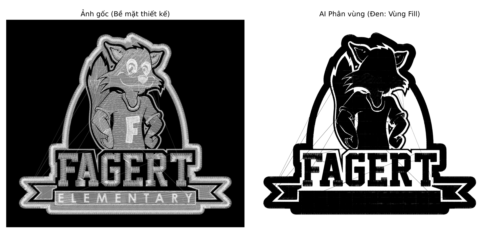

# Pipeline Giai đoạn 1: Binary Fill Segmentation (Nhận diện Mảng Thêu)

**Mục tiêu:** Xây dựng Baseline Model có khả năng phân tách chính xác vùng mảng thêu đặc (Fill) ra khỏi hình nền (Background) và các đường chỉ viền rời rạc (Run/Outline), giải quyết bài toán thiếu Ground Truth chuẩn từ file `.emb` trên môi trường macOS.

---

## Khâu 1: Auto-Labeling & Data Generation (`generate_dataset.py`)

Biến đổi trực tiếp từ tọa độ "mã máy khâu" (`.dst`) thành bộ dữ liệu ảnh sắc nét bằng thuật toán Thị giác máy tính (OpenCV) hoàn toàn tự động.

1. **Khởi tạo 2 bản vẽ song song:**
   - _Ảnh Input (Cho AI học):_ Vẽ nét mập (`thickness=2`) để mô phỏng bề mặt sợi chỉ thực tế.
   - _Ảnh Nháp (Để làm Mask):_ Vẽ nét mảnh (`thickness=1`) để tính toán mật độ không gian.
2. **Kỹ thuật Cắt râu Outline (OpenCV Morphology):**
   - **`MORPH_CLOSE` (Kernel 11x11):** Phình to rồi co lại. Ép các nét thêu đan xen sát nhau dính chặt lại thành một "khối bê tông" đặc (Vùng Fill).
   - **`MORPH_OPEN` (Kernel 5x5):** Co lại rồi phình ra. Cắt đứt các "cái đuôi" là đường chỉ Outline mỏng manh dính vào vùng Fill.
3. **Lọc nhiễu (Area Filter):** Dùng `cv2.contourArea`, thẳng tay xóa bỏ mọi mảng có diện tích `< 3000` pixel (chỉ giữ lại khối Fill khổng lồ).
4. **Cắt lát (Sliding Window):** Quét khung `512x512` qua bức tranh khổng lồ.
   - **Đầu ra:** Hàng ngàn cặp ảnh Train/Val/Test với Mask chỉ có 2 màu: Đen (0) và Trắng (255).

---

## Khâu 2: Tiền xử lý Tensor (`dataset.py`)

Băng chuyền tiêu chuẩn hóa dữ liệu trước khi đẩy vào GPU.

- Đọc ảnh Mask bằng chuẩn Grayscale (Xám).
- **Ép nhãn (Labeling):** Thuật toán `mask_np[mask_np > 0] = 1` ép toàn bộ các pixel màu Trắng (255) về nhãn số `1`.
- **Đầu ra Mask Tensor:** Ma trận số nguyên chuẩn PyTorch chỉ chứa giá trị `0` (Nền) và `1` (Fill).

---

## Khâu 3: Kiến trúc Mạng & Đào tạo (`model.py` & `train.py`)

Tối ưu hóa U-Net cho bài toán Nhị phân (Binary) và giám sát chất lượng cấp độ Pixel.

1. **Thu hẹp Cửa ra:** Thiết lập `out_channels=2` cho mạng U-Net gốc.
2. **Giám sát từng Pixel (Micro-metrics):** Đo lường True Positive, False Positive, True Negative, False Negative trên tổng số 262,144 pixel của mỗi bức ảnh.
3. **Chỉ số đánh giá cốt lõi:**
   - Bỏ qua _Accuracy_ (vì bị nhiễu do nền đen quá lớn).
   - Tập trung đo lường **Recall** (Tỷ lệ bắt trúng Fill) và **F1-Score** (Sự cân bằng hoàn hảo).
4. **Weights & Biases (W&B):** Ghi log Loss liên tục theo từng Batch và vẽ biểu đồ Validation Metrics lên Cloud theo thời gian thực.
5. **Tiêu chuẩn Kỷ lục (Checkpointing):** Tự động lưu mô hình `unet_binary_best.pth` dựa trên **F1-Score của tập Validation cao nhất** thay vì Loss thấp nhất.

---

## Khâu 4: Dự đoán Thực chiến (`inference.py`)

Đưa mô hình vào kiểm thử trực quan với ảnh mới.

1. **Phong ấn trọng số:** Bật `model.eval()` và `torch.no_grad()` để tối đa hóa tốc độ.
2. **Bóc tách xác suất:** Dùng `torch.argmax(dim=1)` để chốt kết quả tại từng pixel (Là 0 hay 1?).
3. **Tô màu báo cáo (Color Mapping):** - Nhãn `0` $\rightarrow$ Đổ màu Đen (Nền).
   - Nhãn `1` $\rightarrow$ Đổ màu Xanh lá (Vùng Fill mảng thêu).
4. **Kết quả:** Hiển thị song song ảnh bề mặt thêu gốc và ảnh Mask đã được AI làm sạch hoàn toàn râu ria, sẵn sàng làm tiền đề cho Giai đoạn 2 (Nhận diện Satin/Tatami).

